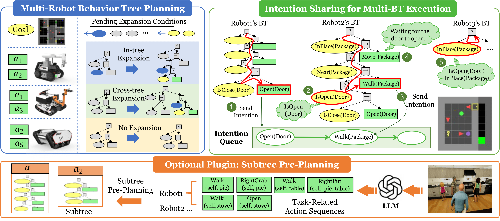
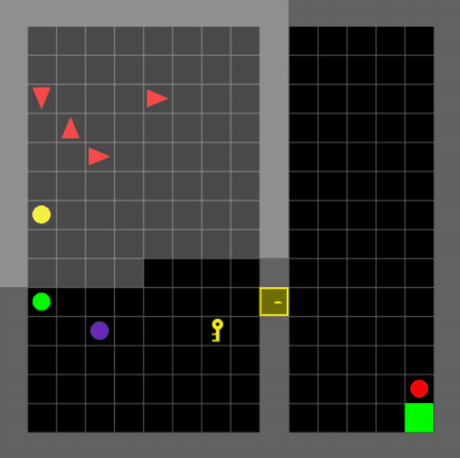

# MRBTP: Efficient Multi-Robot Behavior Tree Planning and Collaboration

> **AAAI 2025 (Oral)**

<div align="center">

[[Website]](https://dids-ei.github.io/Project/MRBTP/)
[[arXiv]](https://arxiv.org/abs/2502.18072)
[[PDF]](https://arxiv.org/pdf/2502.18072)




</div>

MRBTP is a decentralized **Multi-Robot Behavior-Tree Planning** framework. Given a
shared symbolic goal and per-agent action models, it back-chains runnable
behavior trees for each agent so that, executed in parallel, the team
collectively satisfies the goal. The repository ships:

- four planning algorithms (`MRBTP / MABTP / MAOBTP / CABTP`),
- a MiniGrid-based warehouse simulator for quick demos,
- a VirtualHome bridge for household tasks,
- an LLM client used to generate composite-action sub-trees.

---

## 🛠️ Installation

### 1. Environment

```shell
conda create --name mabtpg python=3.10
conda activate mabtpg
```

### 2. Install MABTPG

```shell
cd MRBTP
pip install -e .
```

### 3. (Optional) VirtualHome executable

Only needed if you want to run the household-service scenario. Currently
only Windows is fully tested.

| OS      | Download                                                                                   |
|:--------|:-------------------------------------------------------------------------------------------|
| Linux   | [linux_exec.zip](http://virtual-home.org/release/simulator/v2.0/v2.3.0/linux_exec.zip)     |
| macOS   | [macos_exec.zip](http://virtual-home.org/release/simulator/v2.0/v2.3.0/macos_exec.zip)     |
| Windows | [windows_exec.zip](http://virtual-home.org/release/simulator/v2.0/v2.3.0/windows_exec.zip) |

### 4. MiniGrid / BabyAI

No extra binary download is required — `gymnasium` and `minigrid` are
pulled in automatically by `pip install -e .`.

---

## 🚀 Quick Start

### Minimal demo (MiniGrid)

```shell
python test_multi_minigrid_single_demo/main.py
```



### Demo with composite actions (LLM-style sub-trees)

`test_multi_minigrid_single_demo/main2.py` is a self-contained example
that combines:

- a custom `MiniGrid-DoorKey-8x8-v0` layout,
- 2 agents,
- a `CompositeActionPlanner` that pre-builds reusable sub-trees
  (e.g. *Move ball-1 to room-1 and place it next to ball-3*),
- the optimal planner `MAOBTP`,
- live rendering of every tick.

```shell
python test_multi_minigrid_single_demo/main2.py
```

All artefacts (`robot-i.bt`, `robot-i.svg`, sub-tree diagrams) are
written to `test_multi_minigrid_single_demo/output/` so the workspace
root stays clean.

### Customising the environment

Subclass `MiniGridToMAGridEnv`
(see `mabtpg/envs/gridenv/minigrid/minigrid_env.py`) **or** register a
custom MiniGrid env via `gymnasium.envs.registration.register` (see the
`register(...)` block in `main2.py` for a working example) to construct
your own room layouts. Pre-built scenarios are listed in
`MiniGrid_all_scenarios.txt`.

---

## 🧠 Planning Algorithms

The `mabtpg/btp/` package exports four classes whose names match the
paper one-to-one. See
[`mabtpg/btp/README.md`](mabtpg/btp/README.md) for the full cheat-sheet.

| Paper term            | Class      | File                       | What it does                                                |
|-----------------------|------------|----------------------------|-------------------------------------------------------------|
| **MRBTP**             | `MRBTP`    | `multi_robot.py`           | Top-level facade that returns runnable per-agent BTs.       |
| MR-BTP (baseline)     | `MABTP`    | `multi_robot_basic.py`     | Per-step FIFO back-chaining search.                         |
| Optimal MR-BTP        | `MAOBTP`   | `multi_robot_optimal.py`   | Cost-priority heap search; supports composite actions.      |
| Composite-action BTP  | `CABTP`    | `composite_action.py`      | Single-agent planner that builds sub-tree macros.           |

```python
# Recommended imports
from mabtpg.btp import MRBTP, MABTP, MAOBTP, CABTP
from mabtpg.btp import PlanningAgent, PlanningCondition

# Backward-compatible alias for the paper's historical class name
from mabtpg.btp import DMR     # DMR is MRBTP → True
```

---

## 📂 Directory Structure

```
mabtpg/
│
├── agent/             — Configuration for intelligent agents.
├── llm_client/        — Standalone LLM integration module
│   ├── base.py            BaseLLMClient (chat / tool-calling / embeddings)
│   ├── llms/              Concrete clients (LLMGPT3, LLMGPT4, LLMGPT4o)
│   └── schemas/           Pydantic schemas used as OpenAI tools
├── btp/               — Behavior-tree planning algorithms (see btp/README.md)
│   ├── base/                      PlanningAgent / PlanningCondition
│   ├── multi_robot_basic.py       MABTP   — FIFO baseline
│   ├── multi_robot_optimal.py     MAOBTP  — cost-priority heap; composites
│   ├── composite_action.py        CABTP   — single-agent macro builder
│   └── multi_robot.py             MRBTP   — paper-aligned facade
│                                            (exports DMR = MRBTP alias)
├── behavior_tree/     — Components of the behavior-tree engine
├── envs/              — Environments for agent interaction
│   ├── base/              Foundational elements
│   ├── gridenv/
│   │   └── minigrid/      Warehouse-management scenario
│   ├── virtualhome/
│   │   └── simulation/    VirtualHome Unity / evolving-graph simulators
│   └── numericenv/        Numerical simulation platform
└── utils/             — Supporting functions and utilities

simulators/            — Platforms for realistic training environments

test_multi_minigrid_single_demo/
                       — Smallest end-to-end runnable demo (start here)

test_experiment/       — Modules for testing BT planning, LLMs and scene
│                        interactions.
├── exp1_robustness_parallelism/
│   ├── code/
│   └── results/
└── exp2_subtree_llms/
    ├── code/
    │   ├── data/
    │   └── llm_data/
    └── results/
```

---

## 🧪 Reproducing the Paper Experiments

| Folder                                                | Topic                                              |
|-------------------------------------------------------|----------------------------------------------------|
| `test_experiment/exp1_robustness_parallelism/code/`   | Robustness + parallelism scaling experiments       |
| `test_experiment/exp2_subtree_llms/code/`             | LLM-generated sub-tree macros for composite acts   |

Each experiment folder ships its own `code/` (entry-point scripts) and
`results/` (CSV / SVG / BT artefacts) so runs are reproducible end-to-
end.

---

## 📑 Citation

If you find this repository useful, please cite:

```bibtex
@inproceedings{mrbtp2025,
  title     = {MRBTP: Efficient Multi-Robot Behavior Tree Planning and Collaboration},
  author    = {Anonymous Authors},
  booktitle = {Proceedings of the AAAI Conference on Artificial Intelligence},
  year      = {2025},
  note      = {Oral presentation. arXiv:2502.18072}
}
```

---

## License

This project is licensed under the MIT License — see the
[LICENSE](LICENSE) file for details.
